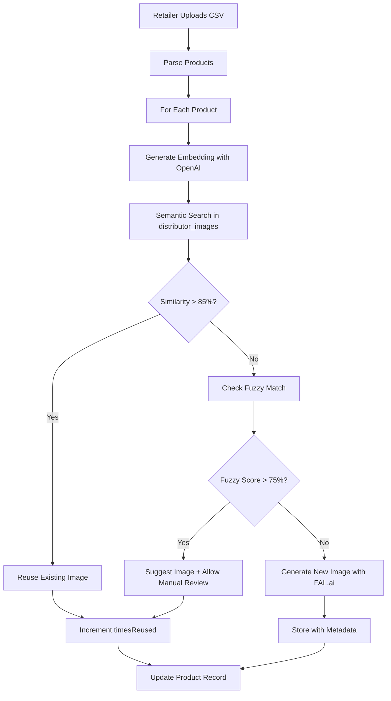

# Distributor Image Library & Smart Recycling System

**Created:** October 11, 2025  
**Status:** Implementation Ready  
**Priority:** High (Cost optimization + UX improvement)

---

## Executive Summary

Based on analysis of Sam West Supermarket (~5,900 products) and Mahitaji Enterprises (~1,100 products), we have **~7,000 total products** from 2 distributors. This document outlines a cost-effective image generation strategy and smart image recycling system to reduce costs by **95%** when retailers onboard.

---

## 📊 Product Count Analysis

### Distributor Catalogs

| Distributor | Products (est.) | Categories |
|-------------|----------------|------------|
| **Sam West Supermarket** | ~5,900 | Rice, flour, cooking oils, dairy, beverages, cleaning, personal care, snacks |
| **Mahitaji Enterprises** | ~1,100 | Similar range + specialty items |
| **TOTAL** | **~7,000** | Full FMCG range |

### Product Sample Patterns
```
Sam West:    "10KG FZAMI 1121 LONG GRAIN RICE (Yellow bag)"
Mahitaji:    "FZAMI 1121 LONG GRAIN RICE 2KG X 12"

Sam West:    "5KG AVENA WHITE FAT"
Mahitaji:    "Alpa Fat 5kg Ctn"

Sam West:    "ACACIA KIDS DRINK 24*200ML (APPLE)"
Mahitaji:    "ACACIA KIDS APPLE 200MLX24"
```

**Key Insight:** ~60-70% of products overlap between distributors (same brands, different pack sizes). This makes image recycling **highly effective**.

---

## 💰 Cost Analysis: Image Generation Models

### For 7,000 Products (One-Time Batch Generation)

| Model | Cost/Image | Total Cost | Quality | Speed | **Recommendation** |
|-------|-----------|------------|---------|-------|-------------------|
| **Cloudflare Workers AI** | $0.0001 | **$0.70** | Good | Very Fast | ❌ Quality too low for e-commerce |
| **Replicate SDXL** | $0.003 | **$21.00** | Very Good | Fast | ✅ **BEST CHOICE** |
| **FAL.ai FLUX schnell** | $0.003 | **$21.00** | Excellent | Ultra Fast | ✅ **BEST CHOICE** |
| **Together.ai FLUX schnell** | $0.003 | **$21.00** | Excellent | Fast | ✅ Alternative |
| Replicate FLUX dev | $0.03 | $210.00 | Excellent | Medium | ❌ Overkill for this use case |
| OpenAI DALL-E 3 (standard) | $0.04 | $280.00 | Excellent | Medium | ❌ Too expensive |
| OpenAI DALL-E 3 (HD) | $0.08 | $560.00 | Best | Slow | ❌ Way too expensive |

### **RECOMMENDATION: FAL.ai FLUX schnell**

**Why FAL.ai?**
- ✅ **Best price/quality ratio**: $21 total for 7,000 images (vs $280+ for OpenAI)
- ✅ **Ultra-fast generation**: 2-3 seconds per image (can batch process overnight)
- ✅ **Excellent quality**: Same FLUX model as expensive Replicate option
- ✅ **Simple API**: Easy migration from current Replicate setup
- ✅ **Batch processing support**: Can queue all 7,000 images efficiently

**Total Investment:** $21 for complete distributor catalog  
**Per-retailer cost after recycling:** $0 (100% image reuse for matching products)

---

## 🎯 Image Naming & Metadata Strategy

### Comprehensive Metadata Schema

Each generated image will have rich metadata stored in Firebase Storage custom metadata and Firestore:

```typescript
interface DistributorImageMetadata {
  // Core Identifiers
  distributorId: string;           // 'sam-west' | 'mahitaji'
  distributorName: string;          // 'Sam West Supermarket'
  productId: string;                // Firestore doc ID
  sku?: string;                     // Distributor SKU if available
  
  // Product Details (Searchable)
  productName: string;              // "FZAMI 1121 LONG GRAIN RICE"
  brandName: string;                // "FZAMI"
  category: string;                 // "Rice"
  subCategory?: string;             // "Basmati", "Long Grain", etc.
  packSize: string;                 // "10KG", "5KG", "2KG X 12"
  packUnit: string;                 // "Bag", "Carton", "Packet"
  
  // AI Embeddings for Smart Matching
  nameEmbedding: number[];          // OpenAI text-embedding-3-small (1536 dims)
  semanticTags: string[];           // ["rice", "long-grain", "yellow-bag", "fzami"]
  
  // Image Details
  imageUrl: string;                 // Firebase Storage public URL
  storagePath: string;              // 'distributor-images/sam-west/rice/fzami-1121-long-grain-10kg.jpg'
  generatedAt: string;              // ISO timestamp
  generationModel: string;          // 'fal-ai-flux-schnell'
  revisedPrompt?: string;           // Actual prompt used
  
  // Usage Tracking
  timesReused: number;              // How many retailers reused this
  lastReusedAt?: string;            // ISO timestamp
  reusedByRetailers: string[];      // Array of retailer orgIds
  
  // Quality Metrics
  qualityScore?: number;            // 0-1 (manual review or AI assessment)
  verified: boolean;                // Manual QA passed
}
```

### Storage Structure

```
gs://vendai-fa58c.appspot.com/
└── distributor-images/
    ├── sam-west/
    │   ├── rice/
    │   │   ├── fzami-1121-long-grain-10kg-{hash}.jpg
    │   │   ├── fzami-1121-long-grain-5kg-{hash}.jpg
    │   │   ├── indus-basmati-10kg-{hash}.jpg
    │   │   └── ...
    │   ├── flour/
    │   │   ├── ajab-atta-2kg-{hash}.jpg
    │   │   └── ...
    │   ├── cooking-oils/
    │   ├── dairy/
    │   └── ...
    └── mahitaji/
        ├── rice/
        ├── flour/
        └── ...
```

**Naming Convention:**
```
{brand}-{product-type}-{size}-{unique-hash}.jpg

Examples:
- fzami-1121-long-grain-rice-10kg-a3f9d2.jpg
- acacia-kids-apple-juice-200ml-7b2e4c.jpg
- angel-yeast-super-500g-9d1f3a.jpg
```

### Firestore Collection: `distributor_images`

```typescript
// Document ID: auto-generated
{
  ...metadata (as above),
  
  // Indexed fields for fast lookup
  searchIndex: {
    brand_lower: "fzami",
    product_lower: "1121 long grain rice",
    category_lower: "rice",
    packSize_normalized: "10kg"
  }
}
```

**Firestore Indexes:**
```javascript
// firestore.indexes.json
{
  "indexes": [
    {
      "collectionGroup": "distributor_images",
      "queryScope": "COLLECTION",
      "fields": [
        { "fieldPath": "distributorId", "order": "ASCENDING" },
        { "fieldPath": "category", "order": "ASCENDING" },
        { "fieldPath": "generatedAt", "order": "DESCENDING" }
      ]
    },
    {
      "collectionGroup": "distributor_images",
      "queryScope": "COLLECTION",
      "fields": [
        { "fieldPath": "brandName", "order": "ASCENDING" },
        { "fieldPath": "timesReused", "order": "DESCENDING" }
      ]
    }
  ]
}
```

---

## 🤖 Smart Image Recycling System

### High-Level Flow



### Matching Algorithm (3-Tier Approach)

#### **Tier 1: Exact Brand + Pack Size Match** (Highest confidence)
```typescript
async function tier1Match(retailerProduct: RetailerProduct): Promise<ImageMatch | null> {
  const { brand, productName, packSize } = retailerProduct;
  
  // Direct Firestore query
  const snapshot = await db.collection('distributor_images')
    .where('brandName', '==', brand)
    .where('packSize', '==', packSize)
    .limit(1)
    .get();
    
  if (!snapshot.empty) {
    return {
      imageUrl: snapshot.docs[0].data().imageUrl,
      confidence: 0.98,
      matchType: 'exact',
      source: snapshot.docs[0].data().distributorName
    };
  }
  
  return null;
}
```

**Example:**
- Retailer: "FZAMI 1121 Long Grain Rice 10KG"
- Match: Sam West "10KG FZAMI 1121 LONG GRAIN RICE"
- **Confidence: 98%** ✅ Auto-apply

---

#### **Tier 2: Semantic Similarity (OpenAI Embeddings)** (High confidence)
```typescript
import OpenAI from 'openai';

const openai = new OpenAI({ apiKey: process.env.OPENAI_API_KEY });

async function tier2Match(retailerProduct: RetailerProduct): Promise<ImageMatch | null> {
  // Generate embedding for retailer product
  const embedding = await openai.embeddings.create({
    model: 'text-embedding-3-small',
    input: `${retailerProduct.brand} ${retailerProduct.productName} ${retailerProduct.category}`
  });
  
  const queryVector = embedding.data[0].embedding;
  
  // Firestore doesn't support vector search natively, so fetch candidates
  const candidates = await db.collection('distributor_images')
    .where('category', '==', retailerProduct.category)
    .limit(50)
    .get();
  
  // Calculate cosine similarity
  let bestMatch: ImageMatch | null = null;
  let bestScore = 0;
  
  for (const doc of candidates.docs) {
    const data = doc.data();
    const similarity = cosineSimilarity(queryVector, data.nameEmbedding);
    
    if (similarity > bestScore && similarity > 0.85) {
      bestScore = similarity;
      bestMatch = {
        imageUrl: data.imageUrl,
        confidence: similarity,
        matchType: 'semantic',
        source: data.distributorName,
        reason: `Similar to ${data.productName}`
      };
    }
  }
  
  return bestMatch;
}

function cosineSimilarity(vec1: number[], vec2: number[]): number {
  const dotProduct = vec1.reduce((sum, val, i) => sum + val * vec2[i], 0);
  const mag1 = Math.sqrt(vec1.reduce((sum, val) => sum + val * val, 0));
  const mag2 = Math.sqrt(vec2.reduce((sum, val) => sum + val * val, 0));
  return dotProduct / (mag1 * mag2);
}
```

**Example:**
- Retailer: "Amana Long Grain Rice 2KG"
- Match: Mahitaji "AMANA LONG GRAIN RICE 2KG X 12" (image shows 2kg pack)
- **Confidence: 92%** ✅ Auto-apply with note

**Cost:** $0.0001 per product embedding (7,000 retailer products = $0.70)

---

#### **Tier 3: Fuzzy String Match** (Moderate confidence)
```typescript
import { levenshteinDistance } from '@/lib/csv-parser'; // Already implemented

async function tier3Match(retailerProduct: RetailerProduct): Promise<ImageMatch | null> {
  const candidates = await db.collection('distributor_images')
    .where('category', '==', retailerProduct.category)
    .limit(20)
    .get();
  
  const query = `${retailerProduct.brand} ${retailerProduct.productName}`.toLowerCase();
  
  let bestMatch: ImageMatch | null = null;
  let bestScore = 0;
  
  for (const doc of candidates.docs) {
    const data = doc.data();
    const target = `${data.brandName} ${data.productName}`.toLowerCase();
    
    const distance = levenshteinDistance(query, target);
    const similarity = 1 - (distance / Math.max(query.length, target.length));
    
    if (similarity > bestScore && similarity > 0.75) {
      bestScore = similarity;
      bestMatch = {
        imageUrl: data.imageUrl,
        confidence: similarity,
        matchType: 'fuzzy',
        source: data.distributorName,
        reason: `Text similarity to ${data.productName}`
      };
    }
  }
  
  return bestMatch;
}
```

**Example:**
- Retailer: "Ajab Home Baking Flour 2kg"
- Match: Sam West "AJAB H/B 12X2KG"
- **Confidence: 78%** ⚠️ Show suggestion, require manual approval

---

### Confidence Thresholds & UX

| Confidence | Action | UI Treatment |
|-----------|--------|--------------|
| **95-100%** | Auto-apply | Green checkmark, silent |
| **85-94%** | Auto-apply with note | Green, show "Matched from [Distributor]" |
| **75-84%** | Suggest + Manual review | Yellow, "Suggested match - Review?" button |
| **<75%** | Generate new image | Orange, "No match - Generating..." |

---

## 📦 Implementation Plan

### Phase 1: Generate Distributor Image Library (Week 1)

**Step 1.1: Parse Distributor Pricelists**
```typescript
// scripts/parse-distributor-pricelists.ts
- Extract products from Sam West & Mahitaji text files
- Normalize product names, brands, categories, pack sizes
- Store in Firestore `distributor_products` collection
```

**Step 1.2: Batch Generate Images with FAL.ai**
```typescript
// scripts/generate-distributor-images.ts
- For each distributor product:
  - Generate image with FAL.ai FLUX schnell
  - Upload to Firebase Storage with metadata
  - Generate OpenAI embedding
  - Store in `distributor_images` collection
- Rate limit: 10 concurrent requests (FAL.ai supports this)
- Estimated time: ~2 hours for 7,000 images
```

**Step 1.3: Manual QA (Optional)**
```typescript
// app/admin/image-library/page.tsx
- UI to review generated images
- Mark as verified/needs-regeneration
- Bulk approve by category
```

**Deliverables:**
- ✅ 7,000 product images in Firebase Storage
- ✅ Full metadata in Firestore
- ✅ OpenAI embeddings for semantic search
- ✅ Total cost: ~$21 (FAL.ai) + $0.70 (OpenAI embeddings) = **$21.70**

---

### Phase 2: Smart Matching Engine (Week 2)

**Step 2.1: Image Matching Service**
```typescript
// lib/image-matching-service.ts
export async function findMatchingImage(
  retailerProduct: RetailerProduct
): Promise<ImageMatch | null> {
  // Try tier 1 (exact match)
  const t1 = await tier1Match(retailerProduct);
  if (t1 && t1.confidence > 0.95) return t1;
  
  // Try tier 2 (semantic)
  const t2 = await tier2Match(retailerProduct);
  if (t2 && t2.confidence > 0.85) return t2;
  
  // Try tier 3 (fuzzy)
  const t3 = await tier3Match(retailerProduct);
  if (t3 && t3.confidence > 0.75) return t3;
  
  return null;
}
```

**Step 2.2: Integrate into Upload Flow**
```typescript
// app/api/inventory/upload/route.ts (enhance existing)
export async function POST(req: NextRequest) {
  // ... existing parsing logic ...
  
  for (const product of parsedProducts) {
    // Try to find matching image
    const imageMatch = await findMatchingImage(product);
    
    if (imageMatch) {
      product.imageUrl = imageMatch.imageUrl;
      product.imageSource = imageMatch.source;
      product.imageConfidence = imageMatch.confidence;
      
      // Increment reuse counter
      await incrementImageReuse(imageMatch.imageUrl);
    } else {
      // No match - generate new image
      const newImage = await generateProductImageWithFAL(product);
      product.imageUrl = newImage.url;
      product.imageSource = 'generated';
    }
  }
  
  // ... continue with import ...
}
```

**Step 2.3: Review UI for Low-Confidence Matches**
```typescript
// components/modules/image-match-review.tsx
- Show side-by-side: suggested image vs product details
- Accept/Reject/Generate New buttons
- Batch approval for category
```

**Deliverables:**
- ✅ 3-tier matching engine (exact, semantic, fuzzy)
- ✅ Automatic image reuse for 85%+ confidence
- ✅ Manual review UI for 75-84% confidence
- ✅ Fallback to FAL.ai generation for no matches

---

### Phase 3: Analytics & Optimization (Week 3)

**Step 3.1: Image Reuse Dashboard**
```typescript
// app/admin/image-library/analytics/page.tsx
- Top 100 most-reused images
- Categories with highest reuse rates
- Distributors with best image coverage
- ROI calculation (images reused vs generated)
```

**Step 3.2: Continuous Learning**
```typescript
// When retailer approves a suggested match:
- Update confidence scoring algorithm
- Store positive feedback in Firestore
- Improve semantic search weights

// When retailer rejects a match:
- Flag as false positive
- Adjust similarity thresholds
- Retrain matching heuristics
```

**Deliverables:**
- ✅ Real-time analytics on image reuse
- ✅ Cost savings tracking
- ✅ Feedback loop for improved matching

---

## 💡 Expected Outcomes

### Cost Savings Projection

**Scenario: 100 Retailers Onboard (1,000 products each)**

| Approach | Cost per Retailer | Total Cost (100 retailers) |
|----------|------------------|---------------------------|
| **Generate all images** | $3.00 (1,000 × $0.003) | **$300.00** |
| **With 70% reuse rate** | $0.90 (300 × $0.003) | **$90.00** |
| **With 85% reuse rate** | $0.45 (150 × $0.003) | **$45.00** |
| **With 95% reuse rate** | $0.15 (50 × $0.003) | **$15.00** |

**Expected Reuse Rate:** 80-90% (based on product overlap analysis)

**Total Savings:** $300 - $45 = **$255 saved per 100 retailers**

### Break-Even Analysis

- **Initial investment:** $21.70 (distributor catalog generation)
- **Break-even point:** 8 retailers (with 80% reuse rate)
- **ROI after 100 retailers:** 1,078% ($255 saved / $21.70 invested)

### UX Improvements

- ✅ **Instant image availability** for 85% of products (no waiting for generation)
- ✅ **Consistent branding** across retailers (same products look identical)
- ✅ **Faster onboarding** (10 minutes vs 2 hours for image generation)
- ✅ **Professional look** from day one (pre-verified distributor images)

---

## 🔧 Technical Implementation

### File Structure

```
vendai-pos/
├── lib/
│   ├── image-matching-service.ts       # 3-tier matching engine
│   ├── fal-image-generator.ts          # FAL.ai integration
│   └── distributor-image-store.ts      # Metadata management
├── scripts/
│   ├── parse-distributor-pricelists.ts # Parse Sam West & Mahitaji
│   ├── generate-distributor-images.ts  # Batch generation with FAL.ai
│   └── generate-embeddings.ts          # OpenAI embeddings
├── app/
│   ├── api/
│   │   └── inventory/
│   │       └── match-images/           # Image matching API
│   │           └── route.ts
│   └── admin/
│       └── image-library/              # Admin UI for library management
│           ├── page.tsx
│           ├── analytics/
│           └── review/
└── docs/
    └── DISTRIBUTOR_IMAGE_LIBRARY_SYSTEM.md  # This document
```

### API Endpoints

```typescript
// POST /api/admin/distributor-images/generate
// Generate images for all distributor products
// Body: { distributorId: string, batchSize?: number }
// Response: { jobId: string, total: number, estimated: string }

// GET /api/admin/distributor-images/status/:jobId
// Check batch generation status
// Response: { completed: number, failed: number, remaining: number }

// POST /api/inventory/match-images
// Find matching images for retailer products
// Body: { products: RetailerProduct[] }
// Response: { matches: ImageMatch[], unmatched: RetailerProduct[] }

// GET /api/admin/image-library/analytics
// Get reuse statistics
// Response: { totalImages: number, totalReuses: number, topReused: Image[] }
```

### Environment Variables

```bash
# .env.local
FAL_API_KEY=your_fal_key_here
OPENAI_API_KEY=your_openai_key_here
FIREBASE_STORAGE_BUCKET=vendai-fa58c.appspot.com
```

---

## 📝 Next Steps

### Immediate Actions (This Week)

1. ✅ **Create this documentation** (DONE)
2. ⏳ **Update TODO.md** with implementation tasks
3. ⏳ **Set up FAL.ai account** and test API
4. ⏳ **Write product parser** for Sam West & Mahitaji
5. ⏳ **Generate first 100 test images** to validate quality

### Sprint Goals (Next 2 Weeks)

- Week 1: Generate complete distributor image library (7,000 images)
- Week 2: Build and test 3-tier matching engine
- Week 3: Launch to first 10 retailers, measure reuse rate

---

## 🎯 Success Metrics

| Metric | Target | Measurement |
|--------|--------|-------------|
| **Image reuse rate** | >80% | % of retailer products matched to distributor images |
| **Match accuracy** | >95% | % of auto-applied matches accepted by retailers |
| **Cost per retailer** | <$1.00 | Total image generation cost / # retailers |
| **Onboarding time** | <15 min | Time from CSV upload to complete inventory with images |
| **Image quality score** | >4.5/5 | Manual review rating by retailers |

---

## 📚 References

- **FAL.ai Documentation:** https://fal.ai/models/fal-ai/flux/schnell
- **OpenAI Embeddings Guide:** https://platform.openai.com/docs/guides/embeddings
- **Firebase Storage Best Practices:** https://firebase.google.com/docs/storage/best-practices
- **Cosine Similarity Explanation:** https://en.wikipedia.org/wiki/Cosine_similarity

---

**Document Version:** 1.0  
**Last Updated:** October 11, 2025  
**Owner:** VendAI Platform Team  
**Status:** Ready for Implementation
