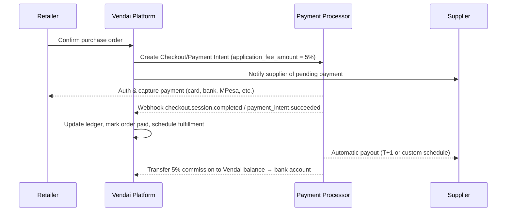

# Marketplace Payment & Webhook Flows

This document captures the recommended payment architecture for Vendai's 5% commission model when using a marketplace-ready processor (Stripe Connect is the reference implementation, but the same concepts apply to Adyen MarketPay, Flutterwave for Business, and PayPal for Marketplaces).

## Objectives

- Collect a 5% marketplace commission on every supplier → retailer order without holding supplier funds directly.
- Provide predictable settlement windows for suppliers and a single balance sheet for Vendai's commissions.
- Create reliable webhook-driven state transitions for ledger updates, credit score adjustments, and alerts.
- Minimize compliance scope (no stored card data, no manually handled payouts) and keep PCI/KYC obligations with the processor.

## Account Model

| Actor | Processor Account Type | Key Notes |
| --- | --- | --- |
| Vendai | Platform / primary account | Owns the Connect (or equivalent) platform, receives application fees, pays processor fees, manages compliance program. |
| Supplier | Connected account (custom/express) | KYC/beneficial ownership handled via processor onboarding. Receives 95% of order after Vendai's 5% commission and processor fees. |
| Retailer | Customer object | Stored payment methods with mandate for auto-debit on order approval and optional ACH/direct-debit agreements for larger orders. |

Vendai keeps a standard corporate bank account to receive platform fees and pay refunds/disputes. No supplier funds are ever swept through Vendai-owned accounts.

## Core Payment Flow

### API Calls

1. **Create payment intent / checkout session**
   - `application_fee_amount = orderTotal * 0.05`
   - `transfer_data[destination] = supplier_connected_account_id`
   - `metadata` includes `order_id`, `retailer_id`, `supplier_id`, `commission_amount`, `credit_snapshot_id`.
2. **Attach saved mandate** (for ACH/SEPA/mobile money): store `payment_method` on the retailer customer and reuse on future orders.
3. **Confirm payment** either via hosted checkout or server-side confirmation if using saved mandates.

### Critical Webhooks

| Event | Triggered By | Vendai Action |
| --- | --- | --- |
| `checkout.session.completed` or `payment_intent.succeeded` | Payment Processor | - Mark order as paid - Record commission revenue - Increment retailer credit utilization and total spend - Emit notification to supplier ops channel |
| `payment_intent.payment_failed` | Payment Processor | - Flag order, pause fulfillment - Trigger dunning workflow to retailer - Register penalty in credit engine (late attempt) |
| `charge.dispute.created` | Payment Processor | - Freeze associated credit line - Notify compliance team - Create task to upload supporting docs |
| `transfer.created` / `payout.paid` | Payment Processor | - Update supplier settlement ledger - Reconcile supplier statement |
| `account.updated` | Payment Processor | - Detect supplier KYC status changes - Surface onboarding tasks in admin console |

Each webhook should be idempotent (store `event_id`/`signature` in the database) and acknowledged within 2 seconds to avoid retries.

## Ledger Updates

Maintain an internal ledger collection/table with:

- `order_id`
- `supplier_id`
- `retailer_id`
- `gross_amount`
- `vendai_commission`
- `processor_fee`
- `net_payout`
- `payment_status`
- `webhook_event_id`
- `timestamp`

The ledger powers financial reporting, supplier statements, and becomes the source of truth for the credit tier engine.

## Refunds & Adjustments

1. Vendai triggers `refund.create` on the processor with the original `payment_intent` id.
2. Vendai issues supplier clawback: the processor reverses the previous transfer; Vendai only covers the commission portion if already withdrawn.
3. Webhook `charge.refunded` should:
   - Adjust retailer credit balance
   - Decrement supplier GMV
   - Re-run credit assessment if refund crosses risk threshold (e.g., dispute rate spike).

Partial refunds should prorate the 5% fee accordingly. Maintain audit entries for transparency.

## Dispute Handling

- On `charge.dispute.created`, freeze additional credit for the retailer (set max utilization to 60%) until resolved.
- Escalate to support with SLA-based reminders.
- If dispute lost, down-tier retailer score and adjust credit limits; if won, restore credit and record positive history.

## Settlement Windows

- Default supplier payout schedule: T+1 rolling or weekly batch (configurable per supplier).
- Vendai commission payouts: daily automatic transfers to Vendai corporate bank account.
- For high-risk suppliers, enforce manual payout release via Connect’s hosted dashboard or your own compliance tooling.

## Compliance Checklist

- **KYC/KYB**: rely on processor onboarding for connected accounts; store verification state locally.
- **PCI**: use hosted payment pages or tokenized payment methods; never handle raw card data.
- **Money transmitter**: avoided as funds never reside in Vendai-controlled accounts.
- **Tax**: track VAT/GST obligations per transaction in ledger metadata for future reporting.

## Integration Next Steps

1. Decide on the processor (Stripe Connect fast to launch; Adyen/Flutterwave for regional coverage).
2. Build `/api/webhooks/payments` endpoint with signature verification and idempotency guard.
3. Extend Firestore/SQL schema with the ledger fields above.
4. Wire credit engine triggers (increase credit score on successful payment; reduce on failure/dispute).
5. Test end-to-end using processor test accounts (supplier onboarding, retailer payment, payout and refund).

This playbook should keep payment orchestration compliant while feeding the credit scoring loop with clean, real-time data.
